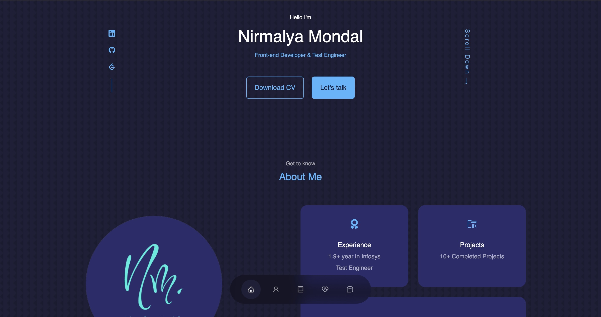

# React JS Portfolio Website

[🔗Live Demo🔗](https://nirmalyamondal.vercel.app/)



<div align="center">

  [](http://makeapullrequest.com) [](https://github.com/ellerbrock/open-source-badges/)
</div>

<table align="center">
    <thead align="center">
        <tr border: 1px;>
            <td><b>Project Stats</td>
            <td><b>🌟 Stars</b></td>
            <td><b>🍴 Forks</b></td>
            <td><b>🐛 Issues</b></td>
            <td><b>🔔 Open PRs</b></td>
            <td><b>🔕 Close PRs</b></td>
        </tr>
     </thead>
    <tbody>
         <tr>
            <td><a href="https://github.com/nirmalyax/React-folio"</a>Project</td>
            <td></td>
             <td></td>
            <td></td>
            <td></td>
           <td></td>
        </tr>
    </tbody>
</table>

<br/>

## Features

**📖 Single-Page Layout**

**🎨 Styled with React, Bootstrap, CSS and Figma with easy to customize colors**

**📱 Fully Responsive**

<br />

## 🚀 How to get started?

Clone down this repository. You will need `node.js` and `git` installed globally on your machine.

1. **Navigate to GitHub Repository**

   - Open your web browser and go to [GitHub](https://github.com).

2. **Login to Your GitHub Account**

   - If you're not already logged in, click the "Sign In" button at the top right corner of the page and enter your credentials.

3. **Find the Repository**

   - Use the GitHub search bar at the top of the page to search for the repository you want to clone.

4. **Access the Repository**

   - Click on the repository's name in the search results or navigate to it through your GitHub account.

5. **Clone the Repository**

   - Click the "Code" button, which is located on the right side of the repository page, just above the file list.

6. **Copy the Clone URL**

   - In the dropdown, ensure "HTTPS" is selected, and then click the clipboard icon to copy the URL to your clipboard.

7. **Open a Terminal**

   - Open a terminal or command prompt on your local machine.

8. **Navigate to the Directory Where You Want to Clone the Repository**

   - Use the `cd` command to move to the directory where you want to store the cloned repository.

9. **Clone the Repository**

   - In the terminal, use the following command to clone the repository, replacing `<repository-url>` with the URL you copied in step 6:

     ```bash
     git clone <repository-url>
     ```

   For example:

   ```bash
   git clone https://github.com/username/repository-name.git


## 🛠 Installation and Setup Instructions

1. Installation: `npm install` or `npm i`

2. In the project directory, you can run: `npm run start` or `npm start`

3. You can start the development server by `npm run dev`

   <br/>

Runs the app in the development mode.\
Open [http://localhost:3000](http://localhost:3000) to view it in the browser. 
The page will reload if you make edits.

<br />
Feel free to contribute to this repo.

### Show some ❤️&nbsp; by giving the star :star: to this repository!!
<h1 align=center> 🧠 Happy Hacking 🧠 </h1>


